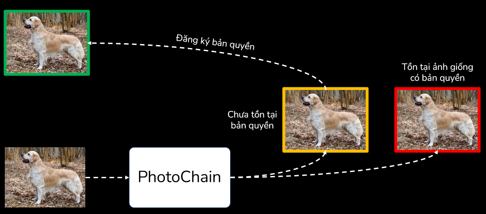

# PhotoChain

A photo sharing system built on AI and Blockchain.

Representation slide: [Google Drive](https://docs.google.com/presentation/d/1dujZVfeHkMrCuqFYhOwBc-Moomen7dQN/edit?usp=share_link&ouid=110570819999860416336&rtpof=true&sd=true)

### 1. Outstanding features

- Store and manage personal image based on Blockchain
- Use AI model to detect duplicate images
- Certificate for a new and unique image and manage those certs

### 2. Project structure

- [AI](ai/README.md) - Contains [iBoT model](ai/ibot/) and [Flask server](ai/host) source code
- [Blockchain](blockchain/README.md) - Contains Solidity smart contracts and deployment code in JS
- [Frontend](frontend/README.md) - Contains frontend source code in React

### 3. In depth

**System structure**

**Register new host**

**Add new image**

**Get license**

