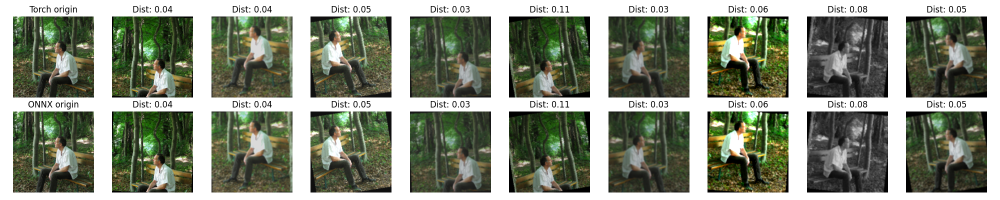
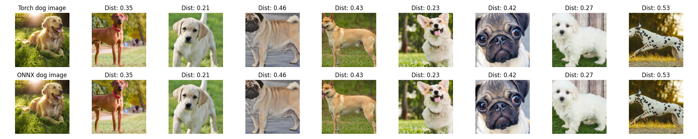
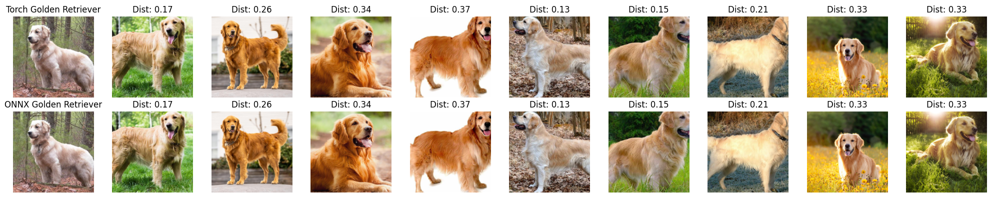

# PhotoChain AI

### 1. Model

- Github: [IBoT](https://github.com/bytedance/ibot)
- Some outstanding features:
  - Self-supervised training on Imagenet21k dataset
  - Siamese networks
  - Use both Masked Image Modelling (MIM) and Contrastive Learning techniques for training
  - Publicly available pretrained models
  - Very high generalization
- IBoT Pytorch Checkpoint: [Google Drive](https://drive.google.com/file/d/11LSSRXTEHH9IH865mPEFa3FkpjhWbkJb/view?usp=share_link)
- IBoT ONNX Checkpoint: [Google Drive](https://drive.google.com/file/d/1ShnI5og6QLcztpDVjbeuTtpUhYwHlaHk/view?usp=share_link)
- IBot demo: [iBoT_demo.ipynb](./ibot/iBOT_demo.ipynb)
- Model structures:
  

### 2. Deployment

- Setup environment

```
cd ai
pip install -r requirements.txt
```

- Convert model to ONNX or download from above link

```
python ibot/convert.py \
  --model_path=[Pytorch model path] \
  --onnx_path=[ONNX output path]
```

- Run AI hosts

```
python -m host.app \
  --config=[Path to config file] \
  --port=[Listening port] \
  --onnx_path=[Path to ONNX]
```

### 3. Results

- Model results on same image with different augmentations



- Model results on different images (different dog breeds)



- Model results on similar images (Same dog breed, different dogs and poses)


